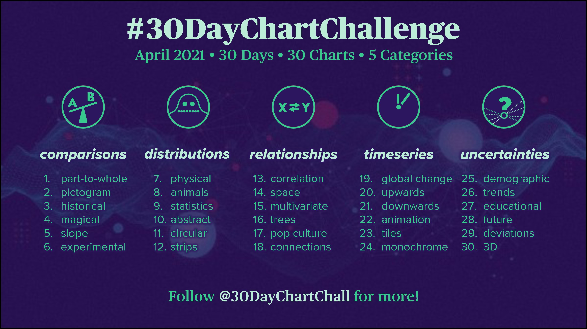

# 30DayChartChallenge
The #30DayChartChallenge was a challenge during April 2021 organized by Dominic Roye (@dr_xeo) and Cederic Scherer (@CedSherer).  

### day25 Uncertainties | Demographic

### day24 Time Series | Monochrome

### day11 Distribution | Circular

### day10 Distribution | Abstract

### day1 Comparison |Part to Whole One

